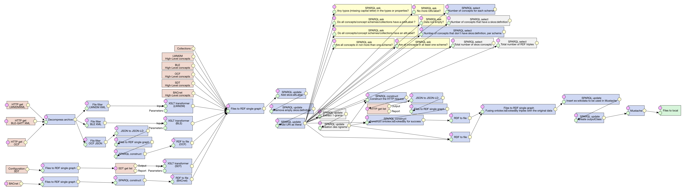

# Web of Things Catalogue

The Web of Things (WoT) catalogue is a collection of concepts extracted
from the following communication and classification standards:
 - BLE GATT
 - BACnet
 - oneM2M
 - OCF
 - OMA LWM2M
 - Project Haystack (TODO update)
 - EDDL (TODO)
 - eCl@ss (TODO)
 - IFC (TODO)
 - OPC UA (TODO)

## Getting Started

See the [online search engine](http://www.vcharpenay.link/wot-catalogue/) to browse concepts or download [the full catalogue in Turtle](wot-catalogue.ttl).

## Documentation

Concept definitions follow the
[Simple Knowledge Organization System (SKOS)](https://www.w3.org/TR/skos-reference/) W3C standard.
SKOS includes two kinds of relation between concepts: subsumption (or inheritance) and relatednes.
On the following diagram, the base information model for each standard is represented with these
two relation types only (white triangle for subsumption, black diamond for relatedness).


Here, relatedness is interpreted as a variant of UML's composition relation between entities.
As a result, all information models are tree-shaped. This relation type is the most abstract
feature encompassing all formalisms under study.

For each concept included in the WoT catalogue, the following fields are available:
 - label
 - human-readable definition
 - related concepts (within the same standard)
 - related data types
 - matches with Wikidata
 - source documentation (TODO)

Example:

```turtle
ble:org.bluetooth.characteristic.indoor_bike_data a skos:Concept, ontolex:LexicalConcept;
    skos:prefLabel "Indoor Bike Data";
    skos:definition """The Indoor Bike Data characteristic is used to send
    training-related data to the Client from an indoor bike
    (Server)."""
    skos:broader ble:Characteristic;
    skos:related ble:Notify, ble:Flags, ble:InstantaneousSpeed, ble:AverageSpeed, ble:InstantaneousCadence, ble:AverageCadence, ble:TotalDistance ble:ResistanceLevel, ble:InstantaneousPower, ble:AveragePower, ble:TotalEnergy, ble:EnergyPerHour, ble:EnergyPerMinute, ble:HeartRate ble:MetabolicEquivalent, ble:ElapsedTime, ble:RemainingTime;
    skos:inScheme ble:Scheme .
```

## Contributing

The WoT catalogue is built with [LinkedPipes ETL](https://etl.linkedpipes.com/).
See an overview of the transformation pipeline:



To install LinkedPipes ETL, follow instructions [on Github](https://github.com/linkedpipes/etl#installation-and-startup).
Then, import `transformation_pipeline.jsonld` and run it.