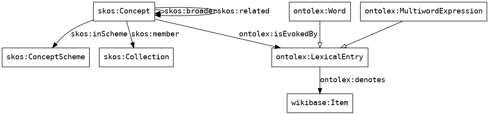
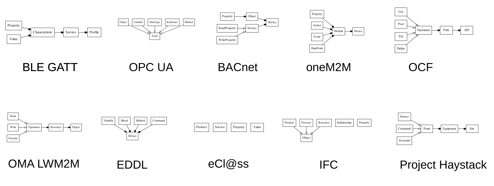

# Web of Things Catalogue

The Web of Things (WoT) catalogue is a collection of concepts extracted
from the following communication and classification standards:
 - [BLE GATT](https://github.com/oesmith/gatt-xml) [_non-official copy_]
 - [BACnet](https://web.archive.org/web/20190906201729/http://bacowl.sourceforge.net/) [_non-official copy_]
 - [oneM2M](https://git.onem2m.org/MAS/Home-Appliances)
 - [OCF](https://github.com/OpenInterConnect/IoTDataModels)
 - [OMA LWM2M](https://github.com/OpenMobileAlliance/lwm2m-registry)
 - [OpenHAB](https://github.com/openhab/openhab-core/tree/3.2.0/bundles/org.openhab.core.semantics/model)
 - [Webthings Schema](https://webthings.io/schemas/)
 - Project Haystack
 - EDDL (TODO)
 - eCl@ss (TODO)
 - IFC (TODO)
 - [OPC UA](https://github.com/OPCFoundation/UA-Nodeset) (TODO)
 - [ICM](https://cimug.ucaiug.org/CIM%20Profiles/Forms/AllItems.aspx) (TODO)
 - [Smart Data Models](https://smartdatamodels.org/) (TODO)
 - [ROS](http://wiki.ros.org/common_msgs) (TODO)

## Getting Started

The WoT catalogue is split in several Turtle file. The entry point is [`index.ttl`](http://purl.org/wot-catalogue).

## Documentation

Concept definitions follow the
[Simple Knowledge Organization System (SKOS)](https://www.w3.org/TR/skos-reference/) W3C standard.
SKOS includes two kinds of relation between concepts: subsumption (or inheritance) and relatednes.
SKOS concepts are also put in different collections and schemes. A scheme corresponds to a source
information model, assumed to be internally consistent but not necessarily consistent with other
sources. If an information model spans several application domains, concepts are grouped in
separate collections (one for each domain).

The WoT catalogue also keeps track of lexical entries that are used to derive concepts (words or
sequences of words). For that purpose, the catalogue also uses the
[Ontolex vocabulary](https://www.w3.org/2016/05/ontolex/#lexical-entries). Distinguishing between
concepts and lexical entries allows then to link concepts with lexical relations (such as
synonymy) and to keep track of possible ambigiuity in concept definitions. The following diagram
shows how SKOS and Ontolex are jointly used.



On the following diagram, the base information model for each standard is represented with these
two relation types only (white triangle for subsumption, black diamond for relatedness).



Here, relatedness is interpreted as a variant of UML's composition relation between entities.
As a result, all information models are tree-shaped. This relation type is the most abstract
feature encompassing all formalisms under study.

For each concept included in the WoT catalogue, the following fields are available:
 - label
 - human-readable definition
 - related concepts (within the same standard)
 - related data types
 - matches with Wikidata
 - source documentation (TODO)

Example:

```turtle
ble:org.bluetooth.characteristic.indoor_bike_data a skos:Concept, ontolex:LexicalConcept;
    skos:prefLabel "Indoor Bike Data";
    skos:definition """The Indoor Bike Data characteristic is used to send
    training-related data to the Client from an indoor bike
    (Server)."""
    skos:broader ble:Characteristic;
    skos:related ble:Notify, ble:Flags, ble:InstantaneousSpeed, ble:AverageSpeed, ble:InstantaneousCadence, ble:AverageCadence, ble:TotalDistance ble:ResistanceLevel, ble:InstantaneousPower, ble:AveragePower, ble:TotalEnergy, ble:EnergyPerHour, ble:EnergyPerMinute, ble:HeartRate ble:MetabolicEquivalent, ble:ElapsedTime, ble:RemainingTime;
    skos:inScheme ble:Scheme .
```

## Contributing

The WoT catalogue is built with [LinkedPipes ETL](https://etl.linkedpipes.com/).
To install LinkedPipes ETL, follow instructions [on Github](https://github.com/linkedpipes/etl#installation-and-startup).
Then, import `pipeline.jsonld` and run it.

Once the pipeline has been executed, the output Turtle files can be committed to the repo.
If the pipeline itself has changed, `pipeline.jsonld` should be committed to the repo as well.
Every stable release of the catalogue should be tagged and pushed to the `release` branch, which is used by Github pages to deploy it online.
